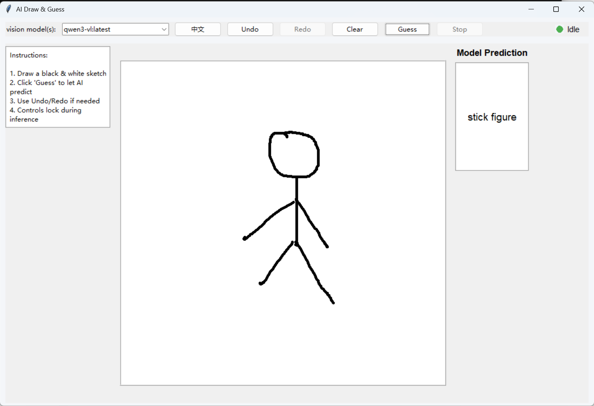
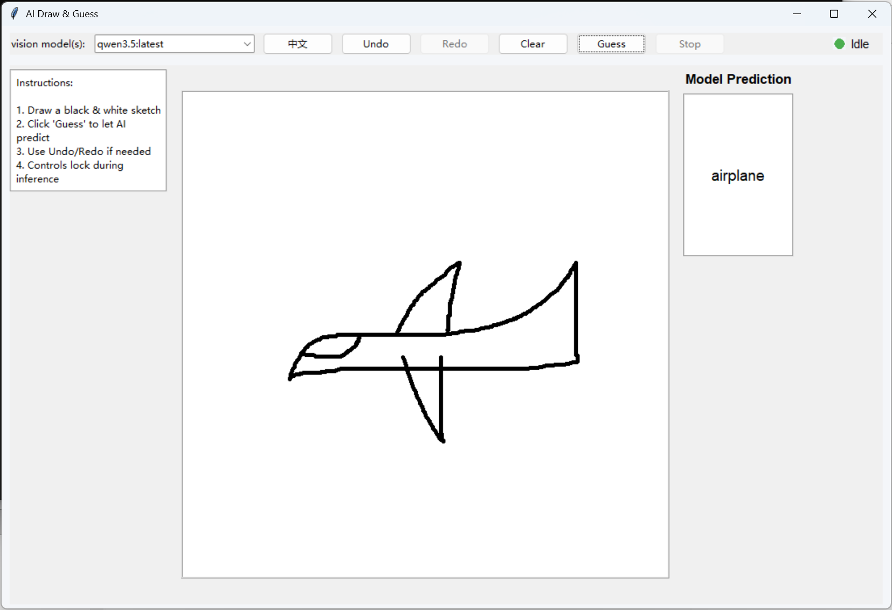

# OllamaGuess

OllamaGuess is a local Tkinter drawing game that lets you sketch a black-and-white image and ask an Ollama vision model to guess what it is.

The app is bilingual and can switch between English and Chinese from the toolbar. It automatically looks for locally installed vision-capable Ollama models, sends the canvas image to the selected model, and shows the returned guess in the side panel.

## Overview





## Features

- Simple 600x600 drawing canvas for black-and-white sketches
- English and Chinese UI toggle
- Vision model selector populated from your local Ollama installation
- Undo, redo, clear, guess, and stop controls
- Local image preprocessing before inference to reduce unnecessary whitespace
- JSON-oriented prompting with tolerant response parsing
- Automatic attempt to start `ollama serve` if Ollama is not already running
- Graceful fallback when no vision model is found: the selector shows `not found` in English and `暂无` in Chinese, and guessing is disabled

## Requirements

- Windows, macOS, or Linux with Python 3.10+
- [Ollama](https://ollama.com/) installed and available on your `PATH`
- At least one vision-capable Ollama model installed locally
- Tkinter available in your Python installation

Python packages:

- `requests`
- `Pillow`

## Install

1. Clone or download this project.
2. Create and activate a virtual environment if you want an isolated setup.
3. Install Python dependencies:

```bash
pip install -r requirements.txt
```

4. Install at least one vision-capable model in Ollama.

Example:

```bash
ollama pull llava
```

Use any Ollama model that actually supports image input.

## Run

Start the app with either:

```bash
python app.py
```

or on Windows:

```bat
applauncher.bat
```

When the app starts, it checks whether Ollama is already listening on `http://localhost:11434`. If not, it tries to launch `ollama serve` automatically.

## How It Works

1. Draw on the canvas with the left mouse button.
2. Choose a detected vision model from the selector.
3. Click `Guess`.
4. The canvas image is cropped around the drawing, resized to `224x224`, encoded as PNG, and sent to the Ollama chat API.
5. The model is prompted to return JSON in the form `{"guess":"..."}`.
6. The app extracts the guess and displays it in the result panel.

During inference, the drawing and model controls are temporarily disabled. You can click `Stop` to send a stop request to Ollama.

## Model Detection

The app calls Ollama's `/api/tags` and `/api/show` endpoints and treats a model as vision-capable when one of these signals is present:

- `vision` in the model file metadata
- `multimodal` in the model file metadata
- `llava` in the model name
- `vl` in the model name

If no matching model is detected, the selector shows a localized placeholder and the guess button remains disabled.

## Notes

- This project is designed for local use and depends on your local Ollama runtime.
- Guess quality and speed depend heavily on the selected model and your hardware.
- The current UI starts in English by default.
- Tkinter is part of the Python standard library, but some Linux distributions package it separately.

## Troubleshooting

### The model selector says `not found`

- Confirm Ollama is installed correctly.
- Run `ollama list` and verify that at least one vision-capable model is installed.
- If your model supports images but is not detected, its metadata or name may not match the app's current detection rules.

### The app says nothing useful or returns `Unknown`

- Try a clearer sketch with stronger outlines.
- Switch to another vision model.
- Make sure the selected model actually supports image input in Ollama.

### Ollama does not start automatically

- Start it manually:

```bash
ollama serve
```

- Then launch the app again.

## Project Files

- `app.py`: main Tkinter application
- `applauncher.bat`: simple Windows launcher
- `requirements.txt`: Python dependencies
